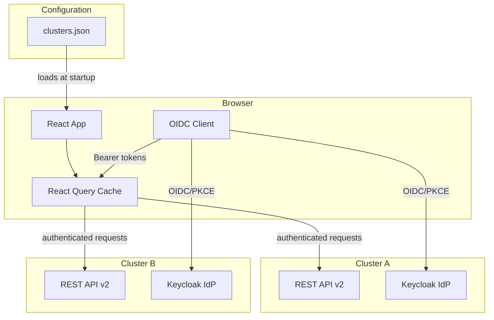
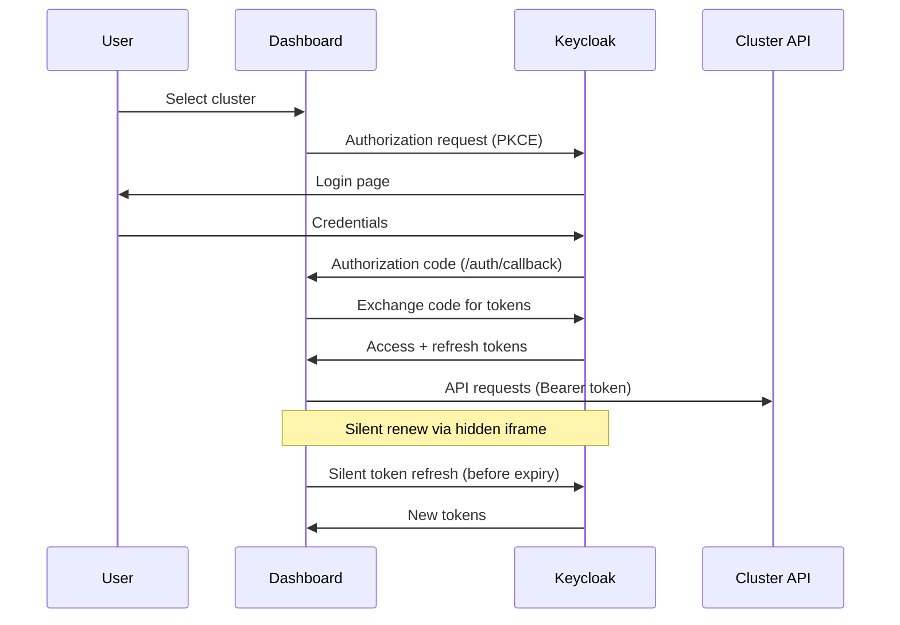
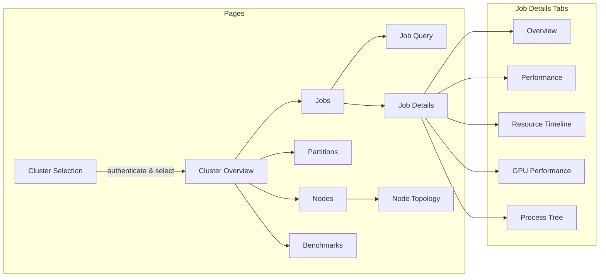

# NAIC Jobanalyzer Dashboard

A monitoring dashboard for HPC clusters, built with React, Chakra UI v3, AG Grid, and React Query.
Connects to cluster REST APIs to display job analytics, node status, and resource utilization across multiple clusters.

## Features

### Multi-Cluster Management
- Browse and subscribe to available HPC clusters
- Independent authentication per cluster (OIDC/PKCE via Keycloak)
- Drag-and-drop sidebar reordering
- Light/dark mode

### Cluster Overview
- Real-time health status with staleness detection
- Resource distribution across partitions (CPU, memory, GPU)
- Job submission and completion trends
- Queue wait time analysis by partition
- Disk I/O metrics with interactive range selection

### Job Analytics
- Live and historical job tables with advanced filtering
- Detailed job view with tabbed interface:
  - Performance metrics (CPU/memory efficiency gauges)
  - Resource timeline (CPU, memory, disk usage over time)
  - GPU performance (utilization, memory, power, temperature)
  - Interactive process tree with timeline animation
- Saved query presets per cluster

### Node Monitoring
- Full node inventory with state filtering
- Per-node time-series metrics (CPU, memory, GPU, disk I/O)
- Zoomable CPU topology diagrams
- GPU inventory per node

### Partitions
- Split-panel partition browser
- Per-partition queue overview, node list, and GPU availability

### Benchmarks
- GPU benchmark comparisons across clusters
- Filterable by precision, GPU count, and test type

## Architecture



## Authentication Flow

Each cluster has its own identity provider. Authentication uses the Authorization Code flow with PKCE.



## Application Structure



## Tech Stack

| Layer | Technology | Purpose |
| --- | --- | --- |
| UI Framework | React 19 | Components and rendering |
| Design System | Chakra UI v3 | Theming, layout, components |
| Routing | React Router v7 | Client-side navigation |
| Data Tables | AG Grid 35 | Sortable, filterable data grids |
| Charts | Recharts 3 | Time-series, bar, and area charts |
| Process Graphs | XYFlow + Dagre | Interactive DAG visualization |
| Server State | TanStack React Query 5 | Data fetching and caching |
| HTTP Client | Axios | API requests with interceptors |
| API Code Gen | @hey-api/openapi-ts | TypeScript SDK from OpenAPI spec |
| Authentication | oidc-client-ts | OIDC/PKCE client |
| Forms | Formik | Job query form validation |
| Drag & Drop | @dnd-kit | Sidebar cluster reordering |
| Build Tool | Vite 8 | Dev server and production bundler |
| Language | TypeScript 5.9 | Type safety |
| Testing | Vitest | Unit test framework |
| Package Manager | Yarn 4 | Dependency management |

## Prerequisites

- [Node.js](https://nodejs.org/) (LTS version)
- [Yarn](https://yarnpkg.com/) (v4+ -- configured via `packageManager` in `package.json`)

## Getting Started

```sh
cd code/dashboard-2
yarn install
yarn dev
```

The dev server starts at `http://localhost:5173` (auto-increments if the port is in use).

## Configuration

All cluster and API configuration is driven by `public/clusters.json`. This file is **not committed to the repository** — create it by copying the provided sample:

```sh
cp public/clusters.sample.json public/clusters.json
```

Then edit `clusters.json` to point to your cluster APIs and identity providers. Each entry defines a cluster with its API base URL and optional OIDC authentication endpoints:

```json
{
  "id": "cluster.example.no",
  "name": "Example Cluster",
  "shortName": "Example",
  "description": "Description of the cluster",
  "icon": "LuServer",
  "apiBaseUrl": "https://example.no/api/v2",
  "authEndpoint": {
    "authorization": "https://keycloak.example.no/realms/realm/protocol/openid-connect/auth",
    "token": "https://keycloak.example.no/realms/realm/protocol/openid-connect/token",
    "userInfo": "https://keycloak.example.no/realms/realm/protocol/openid-connect/userinfo",
    "clientId": "your-client-id",
    "scope": "openid profile email"
  },
  "requiresAuth": true
}
```

Clusters with `requiresAuth: true` use OIDC/PKCE authentication via Keycloak. Each cluster has independent auth state. Clusters with `requiresAuth: false` allow unauthenticated access.

### Cluster Icons

The `icon` field in each cluster entry maps to a predefined icon registry (`src/config/iconRegistry.ts`).

To add new icons, import them from `react-icons` and register them in `src/config/iconRegistry.ts`.

## API Client Generation

The TypeScript API client is auto-generated from an OpenAPI spec:

```sh
yarn openapi-ts
```

This reads `api.json` and generates typed SDK functions, request/response types, and React Query hooks into `src/client/`. The generated code should not be edited manually.

## Building for Production

```sh
yarn build
```

This creates a `dist/` directory containing the static site. In production builds, `console.log` statements are automatically stripped while `console.error` and `console.warn` are preserved.

Serve the `dist/` directory with any web server (nginx, Apache, etc.) and ensure `clusters.json` is configured with the correct API URLs and auth endpoints for the target environment.

## Frontend Project Structure

```
src/
  client/          # Auto-generated API client (from openapi-ts)
  components/      # Reusable UI components
  config/          # Cluster configuration loader
  contexts/        # React context providers (Auth, Cluster)
  hooks/           # Custom hooks for data fetching and state
  layouts/         # Page layout components
  pages/           # Route page components
  types/           # TypeScript type definitions
  utils/           # Utility functions (formatters, transformers)
public/
  clusters.json         # Cluster definitions (runtime config, gitignored — copy from sample)
  clusters.sample.json  # Sample cluster config to use as a starting point
  images/               # Static images and icons
```

## Scripts

| Command | Description |
| --- | --- |
| `yarn dev` | Start development server |
| `yarn build` | Type-check and build for production |
| `yarn preview` | Preview the production build locally |
| `yarn lint` | Run ESLint |
| `yarn test` | Run tests with Vitest |
| `yarn openapi-ts` | Regenerate API client from `api.json` |
